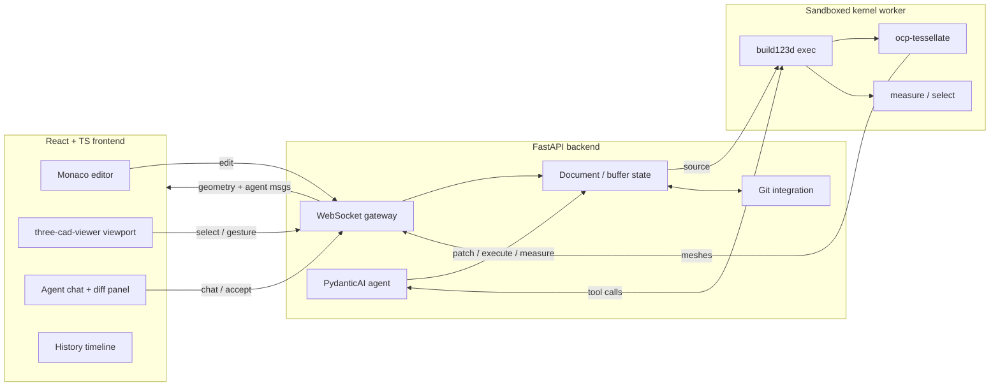

# AI-native code-first CAD — v0 architecture plan

A purpose-built environment where the canvas **is** code, and a human, an AI agent, and the
viewport all edit the same source. React/TS frontend ↔ WebSocket ↔ Python backend running
build123d, with a **PydanticAI** agent living server-side.

---

## 0. The one invariant

**The model is a build123d Python script. That script is the only source of truth.**
Geometry, the history timeline, measurements, colors/materials, part references, and the agent's
view of the world are all *derived from* or *expressed in* that script. Three actors produce edits
to that one buffer:

1. **You** — typing in the in-app editor (the primary interface).
2. **The agent** — proposing patches you accept or reject.
3. **The viewport** — mouse gestures compiled into code edits (drag-to-extrude → a value in the source).

All three go through a single path: `apply_edit(buffer) → run → tessellate → render`. Undo/redo is
buffer history; durable checkpoints are git commits. If you only enforce one thing, enforce this —
it's what keeps the agent honest (every move is diffable) and stops the three editors from forking
reality. Corollary: anything you'd be tempted to store *about* the model (a clicked face, a color, a
part reference) is stored as **code that re-derives it**, never as a transient ID that breaks on re-run.

---

## 1. Component architecture



### Frontend (React + TS + Vite)
- **Editor pane** — Monaco. It *is* the VS Code editor, so you get Python syntax, multi-cursor,
  inline error squiggles, and a real "tiny IDE" feel for free. Don't hand-roll an editor.
- **Viewport** — `three-cad-viewer` (the three.js component `ocp_vscode` and jupyter-cadquery
  already use). It renders OCP tessellations and handles camera, selection, and measurement.
  Do **not** build a viewer from scratch; this is months of work already done.
- **Agent panel** — chat + a diff view of proposed patches with accept/reject. Plus inline (⌘K)
  edits in the editor (§6).
- **History timeline** — operation list with scrub + rollback.
- **WS client** — one connection, JSON envelope protocol (§8).

### Backend (FastAPI, async)
- **WebSocket gateway** — one socket per session; routes typed messages.
- **Document state** — the current buffer, undo stack, parsed operation list, cached geometry.
  In-memory per session; persisted to git on checkpoint. No database in v0.
- **Agent service** — a PydanticAI agent (§4), server-side full Python.
- **Git integration** — GitPython or shelling out. Commits, branches, diffs.
- **Part library** — your reusable parts package + bd_warehouse, on `PYTHONPATH` for both the
  user script and the agent (§5).

### Kernel worker (isolated process)
- Runs the build123d script in a **separate process** from the web server — a hang, infinite loop,
  or OOM must not take the backend down. Re-exec the whole script per edit (deterministic, stateless,
  matches code-as-truth; debounce on the frontend). Returns `{meshes, ops, measurements}` or
  `{error: traceback+line}`.
- Borrow the sandbox pattern from `build123d-mcp`: AST import allowlist, restricted builtins,
  `SIGALRM` wall-clock timeout, restart-the-worker-on-breach. You get isolation and a security
  posture in one move, and you'll want it the moment the agent runs generated code.

---

## 2. The render pipeline (build123d → pixels)

```
build123d objects
   → ocp-tessellate          # mesh + edges + face/edge/vertex indices
   → serialize (its native format, or glTF)
   → WebSocket
   → three-cad-viewer        # three.js render, selection, measure
```

Two libraries do the heavy lifting: `ocp-tessellate` (backend) turns OCP solids into renderable
meshes with topology indices; `three-cad-viewer` (frontend) renders them. Your job is the glue and
the protocol, not the geometry math. Selection stability across re-runs is handled as a hard problem
in §7, not here.

---

## 3. The source-of-truth spine

One function conceptually governs every change:

```python
def apply_edit(buffer: str, edit: Edit) -> str: ...
```

- **Human edit** → Monaco buffer *is* the new source. On change (debounced ~250ms) → run → render.
- **Agent edit** → a structured patch → shown as a diff → on accept, applied to the same buffer →
  run → render. (Optionally an "agent drives" mode auto-applies, but it's still visible and undoable.)
- **Viewport gesture** → compiled into a code edit (§9) → same buffer.

Because all three mutate one buffer, undo/redo is just buffer history and there's never a second
"real" model to reconcile. This is the decision FluidCAD didn't have to make (single-player); you do,
because the agent is a peer editor.

---

## 4. Agent loop & framework — PydanticAI

The agent is a server-side PydanticAI agent. PydanticAI fits this project on three axes: typed
dependency injection (FastAPI-style) for handing it the live session, validated structured outputs
so a "patch" is a guaranteed shape rather than parsed prose, and native Logfire/OpenTelemetry tracing
for the self-correct loop.

```python
from dataclasses import dataclass
from pydantic import BaseModel, Field
from pydantic_ai import Agent, RunContext

@dataclass
class CadDeps:                 # injected per run — the live session
    doc: Document             # current buffer + parsed op list
    kernel: KernelWorker      # run / measure in the sandbox
    selection: Selection      # what's clicked in the viewport
    library: PartLibrary      # your catalog + bd_warehouse

class Patch(BaseModel):       # the agent MUST return this, validated (or it retries)
    diff: str = Field(description="unified diff against the current buffer")
    rationale: str
    targets: list[str] = Field(description="op ids / selectors touched")

cad_agent = Agent(
    "anthropic:claude-...",
    deps_type=CadDeps,
    output_type=Patch,
    instructions="You edit build123d source. Prefer robust selectors; respect design tokens.",
)

@cad_agent.tool
async def measure(ctx: RunContext[CadDeps], expr: str) -> Measurement:
    return await ctx.deps.kernel.measure(expr)          # volume / bbox / clearance

@cad_agent.tool
async def dry_run(ctx: RunContext[CadDeps], diff: str) -> RunResult:
    return await ctx.deps.kernel.execute(apply(ctx.deps.doc.source, diff))
```

**The loop** (what makes it more than a chatbot):

1. You ask (chat or inline ⌘K): *"add a 3mm chamfer to the top rim."*
2. Agent reads current source + geometry/measurements + viewport selection (all via `ctx.deps`).
3. Agent calls `dry_run` / `measure` on its candidate edit — runs it in the sandbox, checks it
   applied and the numbers are sane, and **self-corrects before you see anything**.
4. It returns a validated `Patch`; you get a code diff (and a geometry diff, §6) to accept or reject.

Step 3 is why server-side full-Python matters and beats text-to-CAD black boxes: the agent *sees its
own output* and edits *transparent code you can diff*.

**Tools** (thin wrappers over the kernel; mirror `build123d-mcp`): `read_source`, `propose_patch`,
`execute`, `measure`, `clearance`, `get_selection`, `list_library_parts`.

**Native tools vs MCP.** PydanticAI supports both. For a single tightly-coupled backend, implement
tools **natively** (in-process, lower latency, simpler) but keep them thin wrappers so you can expose
them over MCP later for Claude Code to reuse. **Skip `pydantic-graph` in v0** — one agent with tools
is enough; reach for the graph module only if the loop later needs explicit state-machine structure.

---

## 5. Component library & cohesion

"Reference other parts and build cohesively" is three distinct mechanisms. You want all three.

**Consistency → shared design tokens.** A `lib/design.py` of constants (`WALL = 2.0`, `FILLET = 1.5`,
`CLEARANCE = 0.2`, `M3 = ...`) that every part imports. Change a token, every part re-derives — CSS
variables for CAD, or dbt vars. The agent reads the tokens and respects them, so "add a boss" yields
a boss with *your* wall thickness and fit, not generic defaults.

**Connection → build123d Joints.** Lean on the kernel's native `Joint` system (`RigidJoint`,
`RevoluteJoint`, `LinearJoint`, `CylindricalJoint`, `BallJoint`) with `connect_to`. A part publishes
named connection points; assembly becomes *snapping joints together* rather than hand-computing
transforms. This is PartCAD's "ports/interfaces" idea, built into the kernel you already use. The
agent placing a part becomes "connect its joint to the selected joint," not coordinate guessing.

**Composition → a library-aware agent.** Feed the agent your catalog — each part's signature,
docstring, parameters, joints, and thumbnail — via `list_library_parts()` (retrieval once it's big).
Now "add four mounting bosses" uses *your* `m3_boss`, *your* tokens, snapped to *your* joints. The
library stops being storage and becomes the agent's design system.

Two things fall out for free: an **assembly is just a script that imports parts and connects joints**
— code referencing code, recursively, so history/agent/diff/render all work identically because it's
the same substrate; and **thumbnails come from the render pipeline you already built** (render each
part on save/CI → the library-browser gallery). Versioning is git: monorepo + live imports inside a
project, pinned refs for anything shared.

> Cohesion = **consistency** (tokens) + **connection** (joints) + **composition** (library-aware agent).

---

## 6. UI/UX direction

Beyond the 3-pane layout (editor | viewport | agent), the decisions worth designing toward:

- **Bidirectional code↔geometry highlighting (the keystone).** Hover a line → its faces glow in the
  viewport; click a face → its source line highlights. Makes code-CAD comprehensible instead of
  guesswork, and it's the substrate for selection, agent grounding, and geometry diffs. Depends on
  provenance (§7) — aim the architecture at it.
- **Inline agent edits, Cursor-style.** Select code or a face, ⌘K, "chamfer this 2mm" → ghost-text
  diff you tab to accept. Chat is for conversation; inline is for surgery (most edits are small/local).
- **Color & material live in the code**, not the viewport — `show(part, color=...)` / a material map —
  so they survive re-runs, version in git, and diff. Two render modes off that data: **technical**
  (matcap/flat, edges emphasized, for modeling) and **presentation** (PBR + env lighting + AO).
- **Printability overlay (your A1 edge).** Heatmap each face by angle vs. build direction — overhangs
  past ~45° glow red ("needs support"). Add a build-orientation widget + cross-section/clipping for
  wall-thickness and internal-void checks. A print-aware view general CAD-as-code tools don't have.
- **Geometry diffs for agent patches.** Show the *geometric* consequence (ghost old solid, color
  added/removed material — `argus-diff`-style), not just a text diff. Better review surface for 3D.
- **Auto-extracted parameter sliders.** Top-level params (`length = 80`) → labeled sliders that write
  back to source on drag. The easy 80% of mouse interaction without the hard viewport-gesture work.
- **Keep last-good geometry on error.** Don't blank the viewport on a typo; show the error
  non-destructively. Live-coding dies otherwise.

---

## 7. Hard problems & stances

Four genuinely hard; here's the stance on each so they don't get rediscovered mid-build.

**Stable references / topological naming → store selectors, not IDs.** Don't persist a face/edge ID
that breaks on re-run. The moment a user clicks, *resolve the click to a selector expression*
(`.faces().filter_by(Plane.XY).sort_by(Axis.Z)[-1]`) and store *that*. Selectors survive parameter
changes; IDs don't. The agent is excellent at this translation ("the top rim" → a robust selector),
which is a reason it makes the problem easier, not harder. You still need decent click→selector
synthesis, but you've turned an unsolved-in-general problem into a tractable one.

**Provenance (which line made which face) → an instrumentation spike.** Required for bidirectional
highlighting *and* geometry diffs. Instrument build123d execution so output topology is tagged with
the source location that produced it — wrapping the operation API to record
`(operation, source_line) → faces/edges` is the tractable path; `sys.settrace` is the brute-force one.
Treat as an explicit research milestone (M6); half the best UX hangs off it.

**Incremental recompute → a content-addressed build graph.** Re-exec-per-edit is right for v0. The
scaling answer is dbt/Bazel for geometry: make operations content-addressable (hash of producing code
+ inputs), memoize sub-results, recompute only the dirty subtree. The elegant part — once ops are
content-addressed, **caching, history/rollback, and diffing all fall out of the same mechanism**.
Don't build it in v0, but make the operation model content-addressable from the start so you can.

**Agent correctness → assertions-as-spec (CAD-as-TDD).** Code that *runs* isn't code that's *right*.
Let you (or the agent) write executable specs — `assert part.clearance(shaft) >= 0.2`, "must fit a
20mm bore" — and have the agent iterate until they pass. Objective done-condition, plus regression
tests for your parts for free. Pair measurement assertions with an occasional vision self-check
(render → "does the chamfer read right?").

**Lesser risks.** Concurrent human/agent/slider edits — turn-taking + the approve flow dodges it in
v0; keep edits modeled as patches so CRDT co-editing stays possible later. Sandbox exposure past
localhost — keep build123d-mcp's defense-in-depth. Scope creep — the milestone ladder is the antidote;
M3 is the soul, so don't polish M0–M2 forever.

---

## 8. WebSocket protocol

One JSON envelope, request/response correlated by `id`:

```jsonc
{ "type": "...", "id": "uuid", "payload": { } }
```

**Frontend → backend:** `edit` (full source or patch) · `run` · `select` (clicked entity) ·
`gesture` (mouse op) · `chat` (message to agent) · `accept_patch` / `reject_patch` ·
`checkpoint` (git commit) · `rollback` (to op N or commit).

**Backend → frontend:** `geometry` (meshes + op list) · `error` (traceback + line) ·
`agent_message` · `agent_patch` (proposed diff + geometry diff) · `measurement` · `status`.

Pin this contract early — it's the seam that lets you build frontend and backend in parallel.

---

## 9. Mouse → code (deferred, deliberately)

The drag-to-extrude-then-lock-into-source trick is the hardest UX problem here, and FluidCAD's
implementation is your best reference for it. **Do it last**: it depends on click→selector synthesis
(§7), and — the non-obvious part — a strong agent *reduces the need for it* ("extrude that face 5mm"
typed is often easier than dragging). FluidCAD needs great mouse-to-code because it has no agent; you
have one. The auto-extracted sliders (§6) cover the easy majority of mouse interaction in the meantime.

v0, when you get here: one gesture (drag on a face → insert `extrude(<selector>, amount=<dragged>)`),
prove the round-trip, then grow the gesture set.

---

## 10. Tech stack (concrete picks)

| Layer | Pick | Why |
|---|---|---|
| Frontend | React + TS + Vite | Familiar, fast HMR |
| Editor | **Monaco** | Is VS Code's editor; "tiny IDE" for free |
| Viewport | **three-cad-viewer** | Renders OCP tessellations; don't reinvent |
| FE state | Zustand or plain React | Keep it simple |
| Backend | **FastAPI** | Async, WS support, Pydantic protocol models |
| Agent | **PydanticAI** (+ Logfire) | Typed deps + validated outputs; native tools, MCP-ready; OTel tracing |
| Kernel | **build123d** + **bd_warehouse** | Your language; std parts + Joints |
| Tessellation | **ocp-tessellate** | build123d → mesh |
| Worker isolation | subprocess + build123d-mcp sandbox pattern | Crash/timeout safety |
| Persistence | **git repo on disk** | History + versioning + data sovereignty; no DB |
| Git | GitPython | Commits, diffs, branches |

No database, no Redis, no Pyodide. Git is your store; the worker is your isolation; the browser only
renders. Add SQLite later only if multi-project search/metadata demands it.

---

## 11. Build milestones

Sequenced so a satisfying loop lands early and the hard parts defer:

- **M0 — the round-trip (a weekend).** Monaco → WS → backend runs a hardcoded build123d script →
  ocp-tessellate → three-cad-viewer renders. Type code, see geometry. Proves the spine.
- **M1 — live + errors.** Debounced auto-run, sandboxed worker with timeout/restart, tracebacks as
  editor squiggles, last-good geometry retained on error.
- **M2 — selection + measure.** Click a face/edge → identify it → show properties. Click → selector
  synthesis starts here.
- **M3 — the agent.** PydanticAI agent (typed `CadDeps`, `Patch` output), the self-correct loop,
  diff-and-approve, assertions-as-spec. *This is where it stops being a FluidCAD clone.*
- **M4 — cohesion.** Design tokens, build123d Joints for mating, library-aware composition, parts
  palette + thumbnails.
- **M5 — git + history.** Checkpoints, timeline scrub (run-up-to-op-N), rollback.
- **M6 — provenance + bidirectional highlighting.** The instrumentation spike; unlocks code↔geometry
  hover/click and geometry diffs.
- **M7 — mouse → code.** One gesture first, then grow.

*Parallel track (anytime after M2):* the printability overlay — independent of the above and a quick
win that ties the tool to your A1.

---

## 12. What to mine from FluidCAD

- **Mouse→code binding** — their working answer to the hardest UX problem. Study how gestures map to source.
- **Smart-default ergonomics** — "extrude picks up the last sketch, fillet targets the last selection,
  touching shapes auto-fuse." Hard-won API taste; absorb it.
- **History/rollback model** — how they present a feature tree over a script.
- **Their tutorials as your eval set** — lantern, ice-cube tray, CSWP exam parts. If your tool *and*
  your agent can both reproduce those, it's real. Free acceptance-test corpus.

What *not* to copy: it's single-player with no agent. Your data model has to treat the agent as a peer
editor from line one — everything addressable and diffable so the agent can target "the second fillet"
the same way you'd click it.
